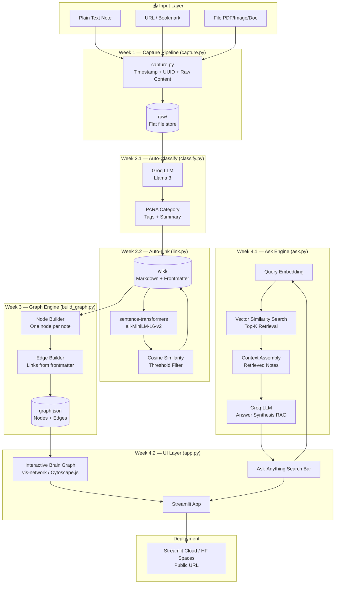
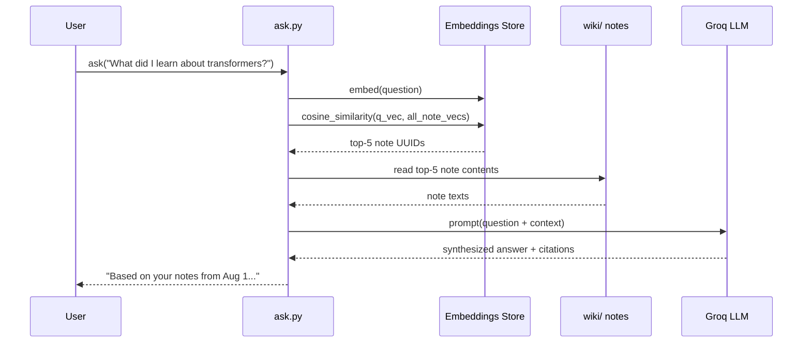
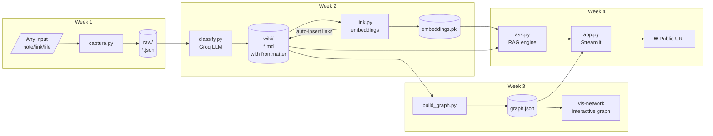
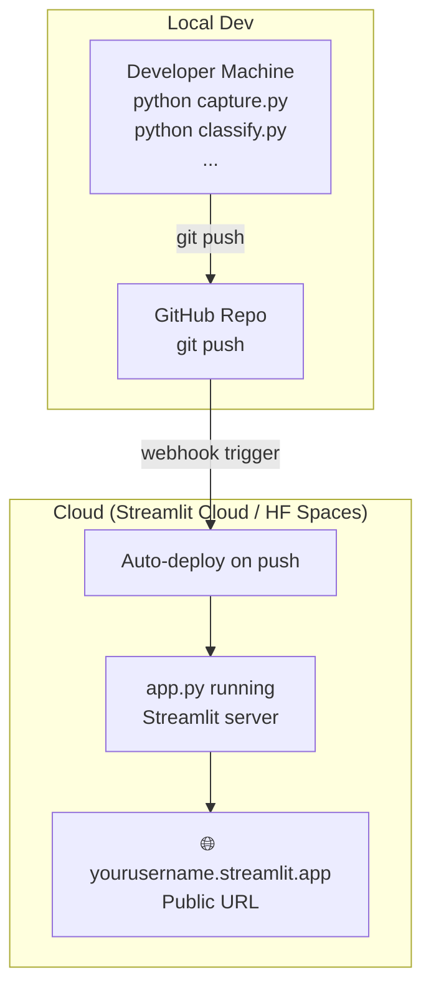

# SecondShelf — Detailed System Architecture

> **Project Tagline**: A brain that organizes itself and answers for you.

---

## 1. High-Level System Overview



---

## 2. Layer-by-Layer Architecture

### 2.1 — Capture Layer (Week 1)

**Purpose**: Single entry-point for all information ingestion.

```
capture.py
│
├── Input handlers
│   ├── handle_text(content: str)   → saves raw text
│   ├── handle_url(url: str)        → fetches page title + saves URL
│   └── handle_file(path: str)      → copies file into raw/
│
├── Metadata generation
│   ├── timestamp: ISO 8601 (e.g. 2026-08-01T13:24:28Z)
│   └── id: UUID4 (e.g. 3f2a1b8c-...)
│
└── Output schema (raw/YYYY-MM-DD_<uuid8>/)
    ├── meta.json
    │   {
    │     "id":        "<uuid4>",
    │     "timestamp": "<ISO-8601>",
    │     "type":      "note" | "url" | "file",
    │     "source":    "<original text / URL / filepath>"
    │   }
    └── content.txt (or content.<ext> for files)
        <raw content or extracted text>
```

**Storage**: `raw/` — directory-per-capture, splitting metadata (`meta.json`) and data (`content.*`).

---

### 2.2 — Classification Layer (Week 2.1)

**Purpose**: LLM-powered automatic PARA filing.

```
classify.py
│
├── Input: raw/YYYY-MM-DD_<uuid8>/meta.json and content.*
│
├── Groq API call (Llama 3 / Llama 3.1 8B)
│   └── Prompt template:
│       "Classify the following note using the PARA framework.
│        Return JSON: { category, tags[], summary }"
│
├── Output schema
│   {
│     "category":  "Projects" | "Areas" | "Resources" | "Archives",
│     "tags":      ["tag1", "tag2", ...],
│     "summary":   "One-line description"
│   }
│
└── Writes to wiki/<UUID>.md
    (YAML frontmatter + original content)
```

**PARA Framework Mapping**:

| Category | Description | Example |
|----------|-------------|---------|
| **Projects** | Has a deadline / goal | "Finish ML course by Sept" |
| **Areas** | Ongoing responsibility | "Health", "Finance" |
| **Resources** | Reference material | Bookmarked article, PDF |
| **Archives** | Completed / inactive | Old project notes |

---

### 2.3 — Auto-Link Layer (Week 2.2)

**Purpose**: Semantic similarity to auto-insert bidirectional links.

```
link.py
│
├── Embedding engine: sentence-transformers
│   └── Model: all-MiniLM-L6-v2 (local, free, fast)
│
├── Process
│   ├── 1. Embed all existing wiki/ notes → vector store (in-memory dict)
│   ├── 2. For each new note: compute its embedding
│   ├── 3. Cosine similarity against all existing embeddings
│   ├── 4. Filter: similarity > THRESHOLD (default 0.65)
│   └── 5. Inject wikilinks into both notes' frontmatter
│
├── Frontmatter schema (wiki/<UUID>.md)
│   ---
│   id: <uuid>
│   timestamp: <ISO>
│   category: Resources
│   tags: [python, ml]
│   summary: "One-line description"
│   links: [<uuid-a>, <uuid-b>]   ← auto-inserted
│   ---
│
└── Threshold tuning
    └── THRESHOLD env var (default 0.65, raise to reduce noise)
```

**Vector Store**: In-memory Python dict `{uuid: np.array}` — persisted to `embeddings.pkl` for incremental updates.

---

### 2.4 — Graph Engine (Week 3)

**Purpose**: Convert the wiki into a traversable graph for visualization.

```
build_graph.py
│
├── Input: all wiki/<UUID>.md files
│
├── Node builder
│   └── For each .md file → node object
│       {
│         "id":       "<uuid>",
│         "label":    "<summary>",
│         "category": "Projects|Areas|Resources|Archives",
│         "tags":     [...],
│         "content":  "<full note body>",
│         "color":    "<PARA-color-map>"
│       }
│
├── Edge builder
│   └── For each link in frontmatter → edge object
│       {
│         "from": "<uuid-source>",
│         "to":   "<uuid-target>",
│         "weight": <cosine-similarity-score>
│       }
│
└── Output: graph.json
    {
      "nodes": [...],
      "edges": [...]
    }
```

**PARA Color Mapping** (for visual distinction in graph):

| Category | Color |
|----------|-------|
| Projects | `#6C63FF` (purple) |
| Areas | `#00C9A7` (teal) |
| Resources | `#F7B731` (amber) |
| Archives | `#747D8C` (grey) |

---

### 2.5 — Query / RAG Engine (Week 4.1)

**Purpose**: Retrieval-Augmented Generation (RAG) — answer natural-language questions from your own notes.

```
ask.py
│
├── ask(question: str) → str
│
├── Step 1: Embed the question
│   └── same sentence-transformers model
│
├── Step 2: Retrieve top-K notes
│   ├── Load embeddings.pkl
│   ├── Cosine similarity: question vs. all note embeddings
│   └── Return top-5 most relevant notes (configurable TOP_K)
│
├── Step 3: Assemble context
│   └── Concatenate retrieved note summaries + content (up to token limit)
│
├── Step 4: LLM synthesis (Groq / Llama 3)
│   └── Prompt:
│       "Using ONLY the notes below, answer the question.
│        Cite which note each fact comes from.
│        Question: {question}
│        Notes: {context}"
│
└── Returns: answer string with source citations
```

**RAG Pipeline Diagram**:



---

### 2.6 — UI Layer (Week 4.2)

**Purpose**: Unified Streamlit app presenting both the graph and Q&A.

```
app.py
│
├── Layout: two-tab Streamlit layout
│   ├── Tab 1: 🧠 Brain Graph
│   │   ├── Load graph.json
│   │   ├── Render with streamlit-agraph or
│   │   │   st.components.v1.html (vis-network / Cytoscape.js)
│   │   ├── Node hover → shows summary + tags
│   │   ├── Node click → expands full note content
│   │   └── Color-coded by PARA category
│   │
│   └── Tab 2: 💬 Ask Your Brain
│       ├── st.text_input("Ask anything...")
│       ├── Calls ask(question)
│       ├── Displays answer
│       └── Displays source notes (expandable)
│
├── Sidebar
│   ├── Capture new note (quick add)
│   ├── Filter graph by PARA category
│   └── Stats: total notes, total links, PARA distribution
│
└── State management: st.session_state
```

---

## 3. Complete File & Folder Structure

```
SecondShelf/
│
├── raw/                        # Week 1: raw captures
│   └── <uuid>.json             # One file per captured item
│
├── wiki/                       # Week 2: processed, linked notes
│   └── <uuid>.md               # YAML frontmatter + note content
│
├── capture.py                  # Week 1: capture CLI
├── classify.py                 # Week 2.1: PARA classification
├── link.py                     # Week 2.2: embedding + auto-link
├── build_graph.py              # Week 3.1: graph.json builder
├── graph.json                  # Week 3.1: exported graph data
├── ask.py                      # Week 4.1: RAG Q&A engine
├── app.py                      # Week 4.2: Streamlit UI
│
├── embeddings.pkl              # Persisted embedding vectors
│
├── static/                     # Week 3.2: JS graph assets
│   ├── graph.html              # vis-network HTML (iframe in Streamlit)
│   └── graph.js                # Cytoscape / vis-network config
│
├── prompts/                    # LLM prompt templates
│   ├── classify_prompt.txt     # PARA classification prompt
│   └── ask_prompt.txt          # RAG synthesis prompt
│
├── .env                        # API keys (GROQ_API_KEY)
├── requirements.txt
└── README.md
```

---

## 4. Data Flow — End-to-End



---

## 5. Technology Stack

| Layer | Technology | Rationale |
|-------|-----------|-----------|
| Language | Python 3.11+ | Universal, rich ML ecosystem |
| LLM API | Groq (Llama 3 / 3.1 8B) | Free tier, fast inference |
| Embeddings | `sentence-transformers` (`all-MiniLM-L6-v2`) | Local, free, no API needed |
| Similarity | `scikit-learn` cosine_similarity | Lightweight, no vector DB needed |
| Note format | Markdown + YAML frontmatter | Human-readable, version-controllable |
| Graph export | JSON | Universal interchange format |
| Graph render | `vis-network` or `Cytoscape.js` | Interactive, force-directed |
| UI | Streamlit | Fastest Python→web path |
| Deployment | Streamlit Cloud / HF Spaces | Free, one-click deploy |
| Env config | `python-dotenv` + `.env` | Secure API key management |

---

## 6. Key Interfaces Between Modules

```python
# capture.py → raw/*.json
{
  "id": str,           # UUID4
  "timestamp": str,    # ISO 8601
  "type": str,         # "note" | "url" | "file"
  "source": str,       # original input
  "content": str       # raw text content
}

# wiki/*.md — YAML frontmatter
---
id: str
timestamp: str
type: str
category: str          # Projects | Areas | Resources | Archives
tags: list[str]
summary: str
links: list[str]       # UUIDs of related notes
---
<note body>

# graph.json
{
  "nodes": [
    { "id": str, "label": str, "category": str,
      "tags": list, "content": str, "color": str }
  ],
  "edges": [
    { "from": str, "to": str, "weight": float }
  ]
}
```

---

## 7. Deployment Architecture



**Environment Variables on Cloud**:
```
GROQ_API_KEY=gsk_...
SIMILARITY_THRESHOLD=0.65
TOP_K_RESULTS=5
```

---

## 8. Milestone → Deliverable Mapping

| Week | Badge | Core Module | Output Artifact | Acceptance Gate |
|------|-------|-------------|-----------------|-----------------|
| 1 | 🏅 Archivist | `capture.py` | `raw/*.json` (10+ items) | One command saves note/link/file |
| 2 | 🏅 Librarian | `classify.py` + `link.py` | `wiki/*.md` (15+ items, linked) | PARA + embeddings auto-link |
| 3 | 🏅 Cartographer | `build_graph.py` + `graph.html` | `graph.json` + live graph | Hover, drag, zoom on real notes |
| 4 | 🏅 Oracle | `ask.py` + `app.py` | Deployed public URL | RAG answers from your own notes |

---

## 9. Finalized Design Decisions ✅

| Decision | ✅ Chosen |
|----------|-----------|
| Embedding persistence | `embeddings.pkl` — in-memory dict, persisted to pickle |
| Groq model | `llama3-8b-8192` — fast, free tier friendly |
| Similarity threshold | `0.65` — tunable via `SIMILARITY_THRESHOLD` env var |
| Streamlit graph component | iframe `vis-network` — maximum rendering control |
| Note ID scheme | `UUID4` — collision-proof at this scale |

---

## 10. Suggested Build Order (Cursor-Optimized)

```
Step 1  →  scaffold repo + requirements.txt + .env template
Step 2  →  capture.py         [Week 1 ✓]
Step 3  →  classify.py        [Week 2.1 ✓]
Step 4  →  link.py            [Week 2.2 ✓]
Step 5  →  build_graph.py     [Week 3.1 ✓]
Step 6  →  static/graph.html  [Week 3.2 ✓]
Step 7  →  ask.py             [Week 4.1 ✓]
Step 8  →  app.py             [Week 4.2 ✓]
Step 9  →  Deploy to Streamlit Cloud
Step 10 →  README.md + GitHub push
```
